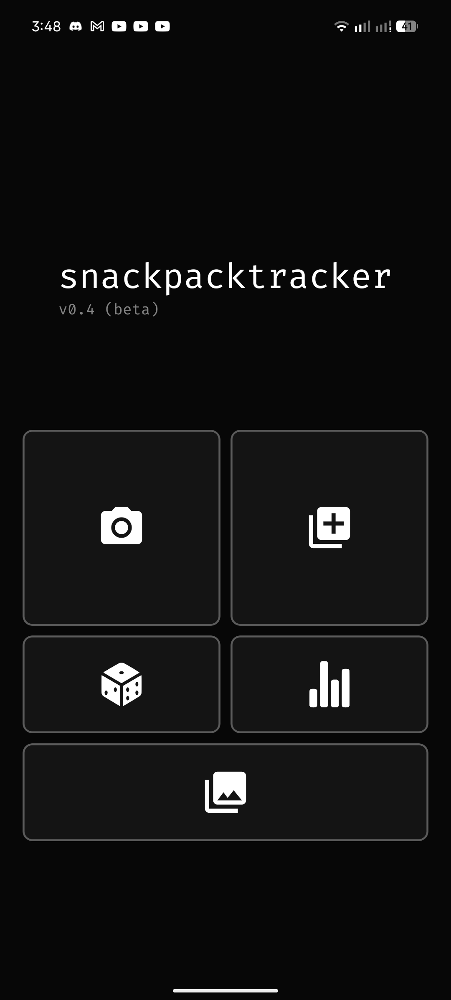
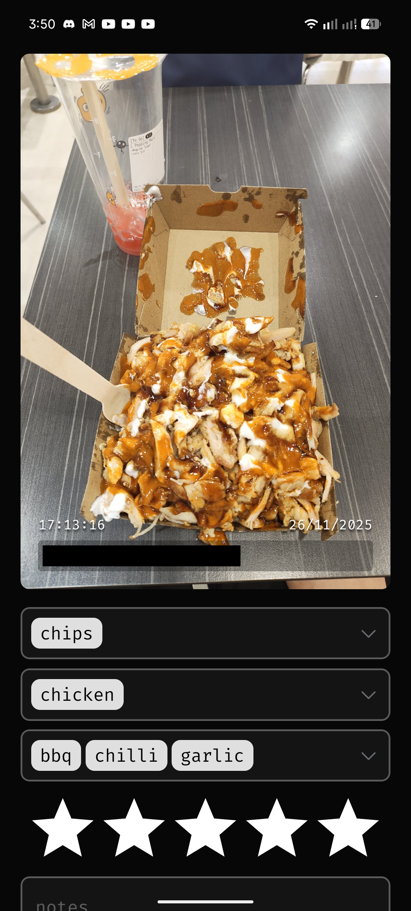
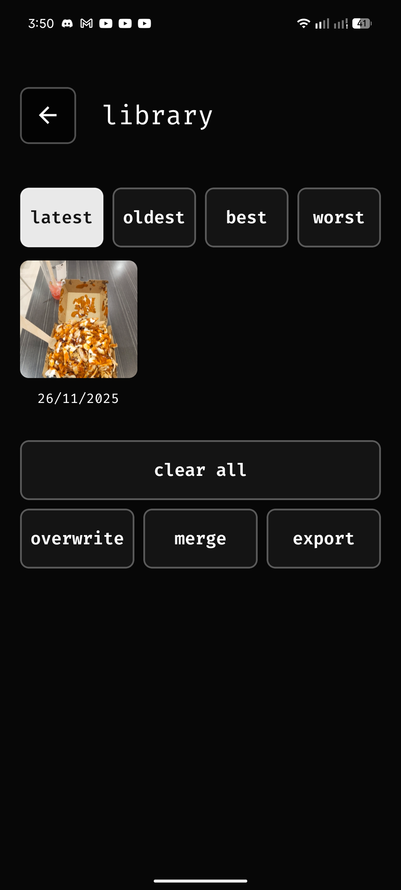
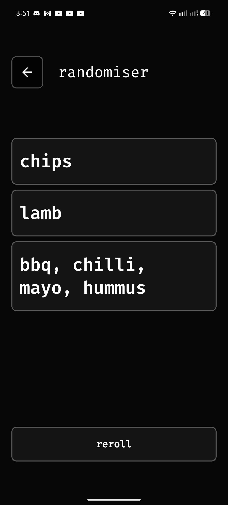
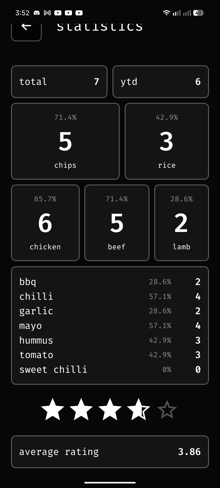
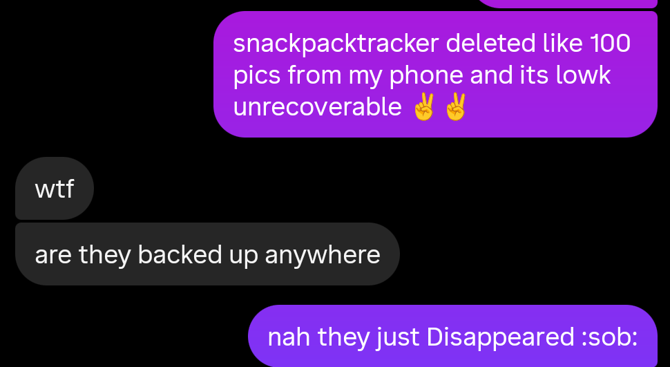

# snackpacktracker

This is snackpacktracker, a very scuffed (but functional) mobile app I created using React Native Expo to support my unhealthy obsession with the Australian 'Halal Snack Pack' (HSP).

<p align="middle">
   
</p>

## features

snackpacktracker allows you to quickly snap a photo of your HSP and log your order, from the base (chips or rice), meats (chicken, beef, or lamb), and the sauces (BBQ, chilli, garlic, mayo, hummus, tomato, or sweet chilli), as well as a star rating out of 5 and an optional note. Alongside this, taking a photo automatically logs the time it was taken and fetches the geographical location of the device as well, all to be stored as an entry with a photo saved to the device's gallery. Entries can also be made by importing a photo from your gallery.


Submitted entries can be viewed in the 'library' page, and can be sorted ascending/descending by date or rating. All entries can be cleared with the 'clear all' button, and clicking on an entry allows you to delete a specific entry, as well as edit and update any of the details. All entries can be exported as a ```.csv``` file, which can then be imported to either overwrite or merge with existing entries.

<p align="middle">
   
   
</p>

<br>

Other features include a HSP randomiser, which displays a random combination of components to make a HSP whenever you have no clue what to order, as well as a statistics page that displays a whole bunch of information about your entries, including numbers/percentages for each HSP component, the average rating across all entries, and totals (lifetime, year to date).

<p align="middle">
   
   
</p>

## process + lore and yapping

With how many HSPs I was eating (UTS Uni Bros <3), I wanted to build an app that helped track and log each one I ate. I originally did this by taking a photo with my phone and saving it to an album in my gallery, but that didn't really hold much information and having to manually migrate each photo was rather tedious. 

A few times in the past year I heard mentions of this technology called React Native (or just React in general; I didn't know what that was either LOL). It looked pretty interesting and I had wanted to look into JavaScript for a while beforehand, so come Decenber 2025, I took this HSP logging app idea and started to work on it with nothing more than some VERY baseline experience following the tutorial from the Expo documentation, with the aim to complete it before the semester started so I could log all the HSPs I ate at university.

It was a major struggle. I had like maybe 2 seconds of experience in JavaScript and was pushed into learning TypeScript right off the bat, which I had no clue about (luckily it wasn't as crazy of a difference to JS, at least for a small project like this). I was almost completely lost, but reading a bunch of documentation and example code helped a lot. With that said, all the code here is very likely extremely janky with horrible illogical logic, but at least it works lol.

I went overseas towards the end of December and returned back around the middle of Janurary. I anticipated this period of time to be the least productive considering I'd be with extended family and similar, but brought my laptop just in case. Surprisingly, a great deal of progress was made during this trip so that was pretty awesome. I worked on it on the flight back as well and felt so performative.

During the ideation phase of this app, another, FAR more experienced friend of mine was inspired by my idea and started working on a general 'food tracker' app of his own. While I can't deny that this discouraged me a bit considering his skills were years beyond mine, I took it as a form of friendly competition, and the drive to see this idea through was greatly strengthened, so yeah thanks matt.

While my knowledge on this technology is still extremely amateurish, I learnt a lot about app development and working with a language and environment I had wanted to learn for a while, so I'm pretty satisfied in the end. Even better is I get to log all my HSPs in a nice little app!! How lovely.

Oh yeah also towards the end of developing this app I messed up permissions and the app ended up deleting 100 photos from my camera roll without recovery LOL we live and we learn :sob:

<p align="middle">
   
</p>

## installing

Run
```
npm install
```

to install all dependencies and then

```
npx expo start
```
to start the app on a local server. I was lowkey planning to put it on the Play Store, but that's pretty pointless tbh.